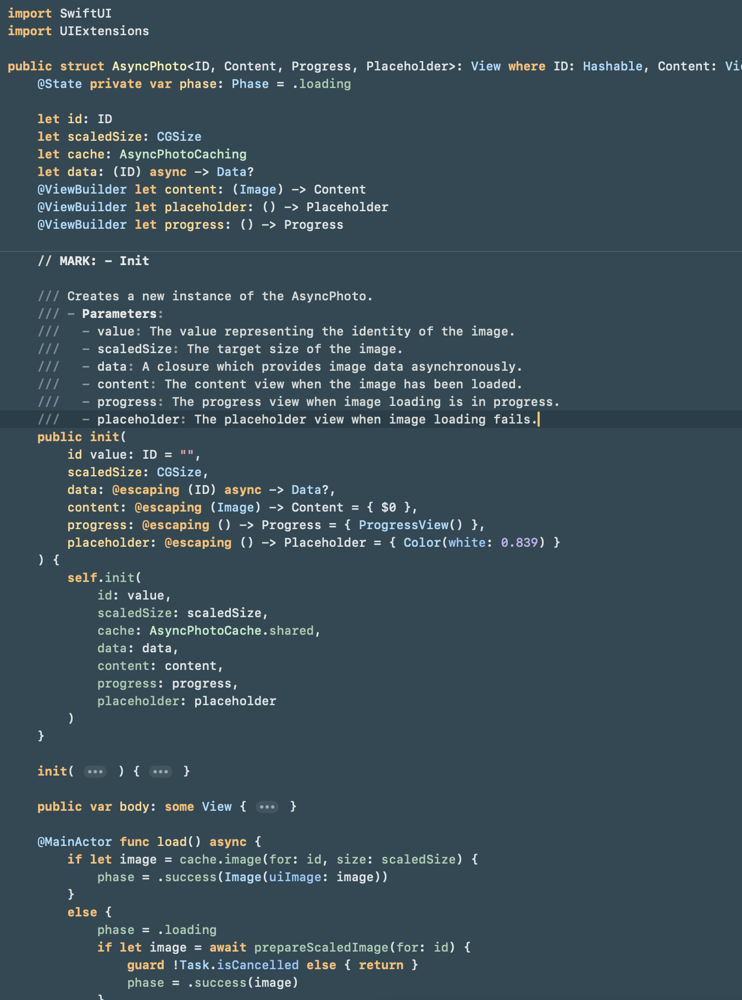

# Augmented Code Dark

A unified dark theme for Xcode, Ghostty, Zed, and Oh My Zsh. It is derived from
the Xcode **Augmented Code (Dark)** palette.



## Install

```sh
./install.sh
```

The installer copies theme files only; it does not change application or shell
settings.

## Activate

- **Xcode:** Relaunch Xcode, then select **Augmented Code (Dark)** in Settings
  > Themes.
- **Ghostty:** Add this line to your Ghostty configuration and reload with
  `Cmd-Shift-,`:

  ```ini
  theme = Augmented Code Dark
  ```

- **Zed:** Open the Theme Selector with `Cmd-K`, then `Cmd-T`, and select
  **Augmented Code Dark**.
- **Oh My Zsh:** Set this in `~/.zshrc`, then start a new shell:

  ```sh
  ZSH_THEME="augmented-code-dark"
  ```

  The prompt uses Powerline glyphs, so select a Nerd Font or another
  Powerline-capable font in your terminal.
