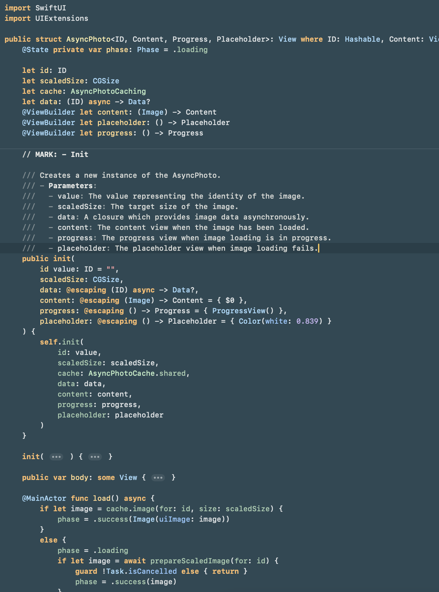

# Augmented Code Dark and Light

Matching dark and light themes for Xcode, Ghostty, Zed, and Oh My Zsh. Starship
uses one color-neutral configuration for both. The light palette comes from
**Augmented Code (Light)** for Xcode.



## Install

```sh
./install.sh
```

The installer copies both variants but does not change application or shell
settings. Dark remains the default selection in the examples below.

## Activate

- **Xcode:** Relaunch Xcode, then select **Augmented Code (Dark)** or
  **Augmented Code (Light)** in Settings > Themes.
- **Ghostty:** Add this line to your Ghostty configuration and reload with
  `Cmd-Shift-,`:

  ```ini
  theme = Augmented Code Dark
  ```

  Use `theme = Augmented Code Light` for the light variant.

- **Zed:** Open the Theme Selector with `Cmd-K`, then `Cmd-T`, and select
  **Augmented Code Dark** or **Augmented Code Light**.
- **Starship:** Add this line to `~/.zshrc`, then start a new shell:

  ```sh
  eval "$(starship init zsh)"
  ```

- **Oh My Zsh:** Set this in `~/.zshrc`, then start a new shell:

  ```sh
  ZSH_THEME="augmented-code-dark"
  ```

  Use `ZSH_THEME="augmented-code-light"` for the light variant.

  The prompt uses Powerline glyphs, so select a Nerd Font or another
  Powerline-capable font in your terminal.

## Minimal Ghostty configuration

```ini
font-family = "SF Mono"
font-size = 13
scrollback-limit = 10000000
theme = Augmented Code Dark
```
